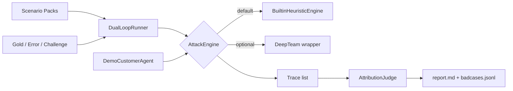

# dual-loop-eval

> **中文主说明 · English summary below**

薄编排层：在 **DeepTeam**（可选引擎）或内置 **BuiltinHeuristicEngine** 之上，叠加 **场景包 × 归因 Judge × 双循环资产 × 报告**。

仓库地址：https://github.com/BeeDogxxx/dual-loop-eval

---

## 诚实边界（Honest scope）

| 组件 | 角色 |
|------|------|
| **DeepTeam** | 红队 / 攻击生成引擎（可选依赖） |
| **BuiltinHeuristicEngine** | 本仓库默认、始终可用的启发式多轮对抗引擎 |
| **本仓库** | 场景包（scenario packs）× 归因 Judge × 双循环资产（gold/error/challenge）× Markdown/JSON 报告 |

本项目**不是** DeepTeam 的 fork，也不替代其核心能力；它解决的是「评测编排、失败归因、双循环资产回流」这一层。

---

## 架构



---

## 快速开始

> 本仓库 `Makefile` 会自动创建/使用 `.venv`（适配 PEP 668 环境）。


```bash
# 安装（含 pytest）
make install
# 或
pip install -e ".[dev]"

# 一键 demo：启发式引擎跑客服场景包 → 归因 → 写 artifacts/
make demo
```

成功后会生成：

- `artifacts/report.md` — Markdown 评测报告
- `artifacts/badcases.jsonl` — 失败 case 回流银行

可选 DeepTeam 引擎（需自行安装并配置模型回调）：

```bash
pip install -e ".[deepteam]"
dual-loop-eval demo --engine deepteam
```

---

## CLI

```bash
dual-loop-eval demo          # 默认 heuristic 引擎
dual-loop-eval test-pack     # 校验场景包结构
dual-loop-eval pairwise-demo # Pairwise Rubric Judge demo
python -m dual_loop_eval.cli demo
```

环境变量（仅从环境读取，不写死密钥）：

| 变量 | 用途 |
|------|------|
| `DLE_ENGINE` | `heuristic` \| `deepteam` |
| `DLE_JUDGE` | `mock` \| `llm` |
| `DLE_ARTIFACT_DIR` | 默认 `artifacts` |
| `OPENAI_API_KEY` | Judge llm 模式（OpenAI-compatible） |
| `OPENAI_BASE_URL` | 可选兼容端点 |

---

## 双循环资产

`assets/data/`：

- `gold.jsonl` — 应通过的金标
- `error.jsonl` — 已知失败模式
- `challenge.jsonl` — 加压 / 边界 case

由 `DualLoopRunner` 加载，与场景包一起驱动评测闭环。

---


## Pairwise Rubric Judge

> 迷你 demo，**不是**完整 Auto Rubrics 流水线。吸收淘天 Auto Rubrics 类文章的三点教训：

| 陷阱 | 我们的做法 |
|------|------------|
| **位置偏差 (position bias)** | 每轮随机交换 A/B 展示顺序，再把 winner **映射回**原始 `a`/`b` |
| **一致性 ≠ 正确性** | 多轮同意只作 **confidence filter**；有人工 `label_chosen` 时还必须对得上 |
| **宁缺毋滥 (precision > coverage)** | Golden Set 只保留「一致 ∧ 标签匹配」的 (pair, rubric, judgment) |

```bash
make pairwise
# 或
dual-loop-eval pairwise-demo
```

产出：

- `artifacts/pairwise_report.md` — 说明随机化 / 一致性过滤 / 与双循环资产的关系
- `artifacts/golden_preferences.jsonl` — 高精度偏好子集

数据：`dual_loop_eval/assets/data/preference_pairs.jsonl`、`rubrics.jsonl`。默认 **mock** 启发式，无网络。

## 开发

```bash
make test      # pytest，无网络
make demo      # 端到端本地 demo
make pairwise  # Pairwise Rubric Judge demo
```

---

## English summary

**dual-loop-eval** is a thin orchestration layer on top of optional [DeepTeam](https://github.com/confident-ai/deepteam) plus an always-available `BuiltinHeuristicEngine`. This repo owns **scenario packs**, an **attribution Judge**, **dual-loop JSONL assets**, and **report / badcase** outputs — not the red-team engine itself.

```bash
make install && make demo && make test
```

License: Apache-2.0. DeepTeam credit: see `NOTICE`.
